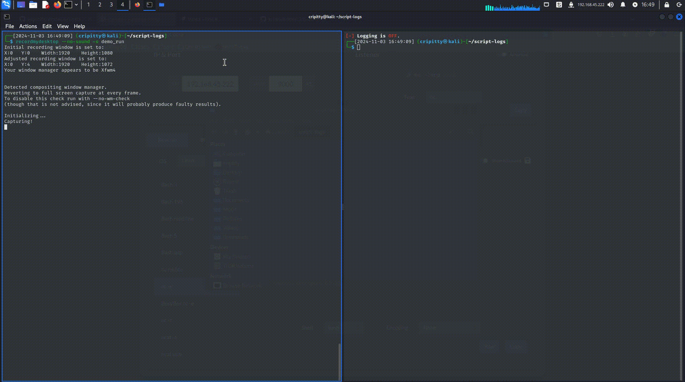

# cmd_logger
- [cmd\_logger](#cmd_logger)
  - [Demo](#demo)
  - [What is this?](#what-is-this)
  - [How to enable](#how-to-enable)
  - [How to use](#how-to-use)
      - [1. Reconfigure the shell configuration/startup file](#1-reconfigure-the-shell-configurationstartup-file)
      - [2. Start logging](#2-start-logging)
      - [3. Stop logging](#3-stop-logging)
      - [4. Check your command console log.](#4-check-your-command-console-log)
## Demo

## What is this?
A bash script for automating the `script` command of linux in all terminals.
> [!WARNING]
> Currently usable for logging commands only for **zsh in kali**.

This script enables you to start a console command logger for every terminals you open after running `log_start`. Also, it closes all the logging sessions if you run `log_stop` and won't run a logging session unless you run `log_start` again.  
Also added **[Date Time]** on the left side of `username@hostname` prompt in the terminal to easily check what time the commands were run.

## How to enable
Copy and paste the the script written inside `cmd_logger.sh` into the last line of your `~/.zshrc` or whatever shell configuration/startup file you're using.  

Also, for the **[Date Time]**, find the function `configure_prompt()` inside `~/.zshrc`, comment it out and paste the script written inside `date_cmd.sh` right below the function commented out.  
  
  > [!NOTE]
  > Do not include `#!/bin/bash` when copy-pasting into `~/.zshrc`.

## How to use
#### 1. Reconfigure the shell configuration/startup file
After pasting the code in the configuration/startup file, run the following in the terminal
```bash
# Only works with .zshrc
$ source ~/.zshrc
```

#### 2. Start logging
Run `log_start`
```bash
└─$ log_start
[+] Script logging is turned ON.
[+] LOGS will be saved in ~/script-logs/LOGS_1028-02:57:43.txt
└─-[~/script-logs] $ ls
LOGS_1028-02:57:43.txt
```

#### 3. Stop logging
Run `log_stop`
```bash
└─$ log_stop   
[-] Stopping logging for all active sessions...
[+] Stopped logging session with PID 1021894.
```
#### 4. Check your command console log.
Check the files created inside `~/script-logs`
